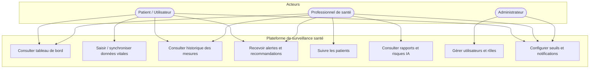

# Diagramme de cas d'utilisation

## Représentation Mermaid

## Cas d'utilisation détaillés

| ID | Cas d'utilisation | Acteur(s) | Description |
|----|-------------------|-----------|-------------|
| UC1 | Consulter tableau de bord | Patient, Professionnel | Visualiser indicateurs actuels et tendances. |
| UC2 | Saisir / synchroniser données vitales | Patient | Envoi manuel ou via dispositifs (IoT, wearables). |
| UC3 | Consulter historique des mesures | Patient, Professionnel | Historique des paramètres dans le temps. |
| UC4 | Recevoir alertes et recommandations | Patient, Professionnel | Notifications et conseils (IA + règles métier). |
| UC5 | Suivre les patients | Professionnel | Liste des patients, état récent, alertes. |
| UC6 | Consulter rapports et risques IA | Professionnel | Synthèses et niveaux de risque calculés par l’IA. |
| UC7 | Gérer utilisateurs et rôles | Administrateur | CRUD utilisateurs, attribution des rôles. |
| UC8 | Configurer seuils et notifications | Patient, Professionnel, Admin | Seuils d’alerte et préférences de notification. |
