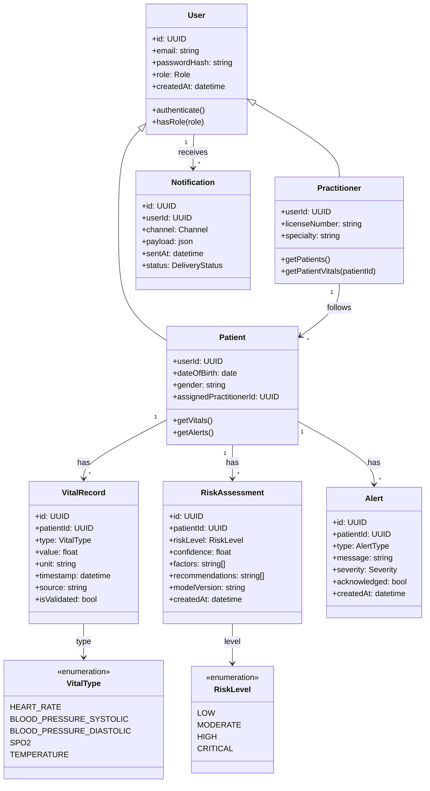

# Diagramme de classes

## Représentation Mermaid

## Packages / modules

- **User management** : User, Patient, Practitioner (profil, auth, rôles).
- **Health data** : VitalRecord, VitalType (stockage et validation).
- **AI / Analytics** : RiskAssessment, RiskLevel (résultats des modèles).
- **Notifications** : Alert, Notification (alertes métier et envoi).
