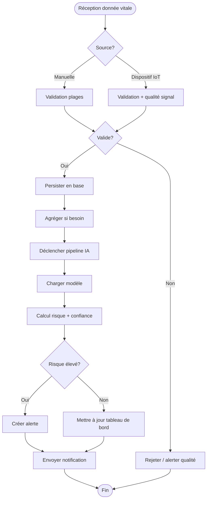
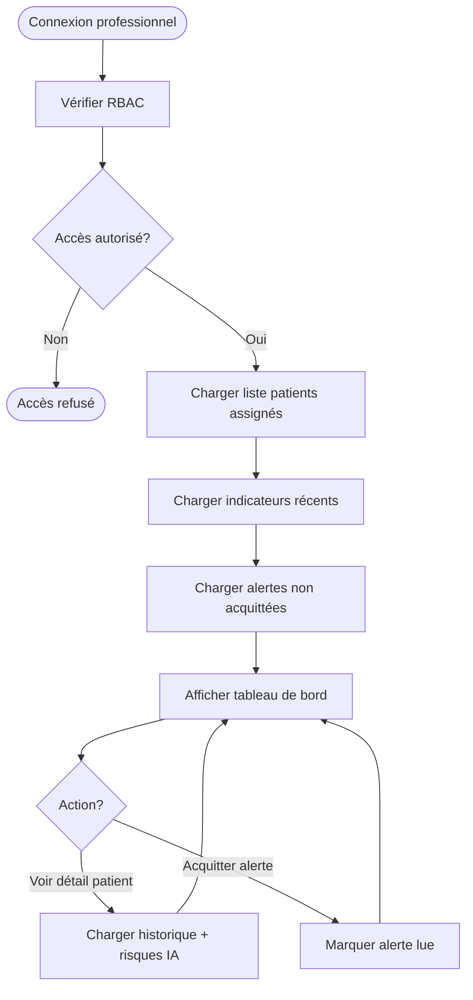

# Diagramme d'activités

## Flux : Traitement des données vitales et évaluation du risque

```mermaid
flowchart TD
    A([Réception donnée vitale]) --> B{Source?}
    B -->|Manuelle| C[Validation plages]
    B -->|Dispositif IoT| D[Validation + qualité signal]
    C --> E{Valide?}
    D --> E
    E -->|Non| F[Rejeter / alerter qualité]
    E -->|Oui| G[Persister en base]
    G --> H[Agréger si besoin]
    H --> I[Déclencher pipeline IA]
    I --> J[Charger modèle]
    J --> K[Calcul risque + confiance]
    K --> L{Risque élevé?}
    L -->|Oui| M[Créer alerte]
    L -->|Non| N[Mettre à jour tableau de bord]
    M --> O[Envoyer notification]
    N --> O
    O --> P([Fin])
    F --> P
```

## Flux : Consultation du tableau de bord par un professionnel

```mermaid
flowchart TD
    A([Connexion professionnel]) --> B[Vérifier RBAC]
    B --> C{Accès autorisé?}
    C -->|Non| D([Accès refusé])
    C -->|Oui| E[Charger liste patients assignés]
    E --> F[Charger indicateurs récents]
    F --> G[Charger alertes non acquittées]
    G --> H[Afficher tableau de bord]
    H --> I{Action?}
    I -->|Voir détail patient| J[Charger historique + risques IA]
    I -->|Acquitter alerte| K[Marquer alerte lue]
    J --> H
    K --> H
```
