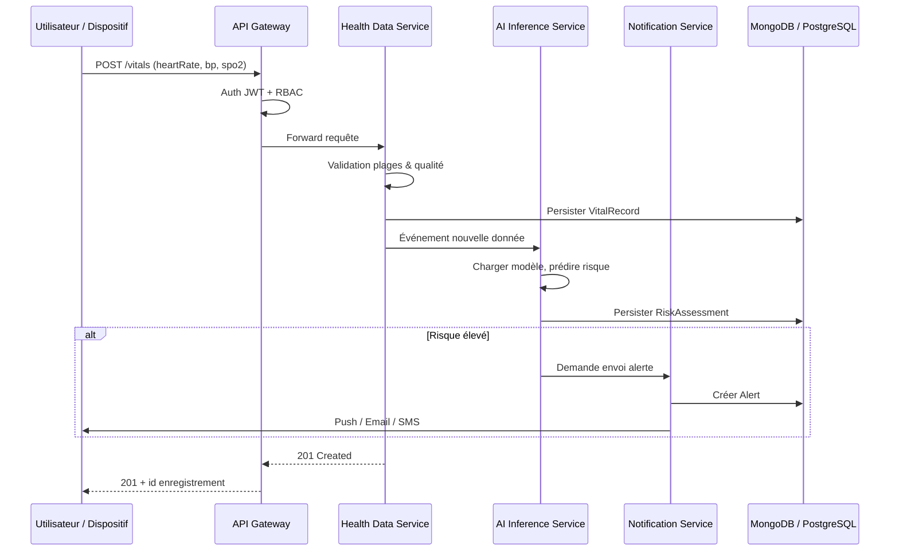
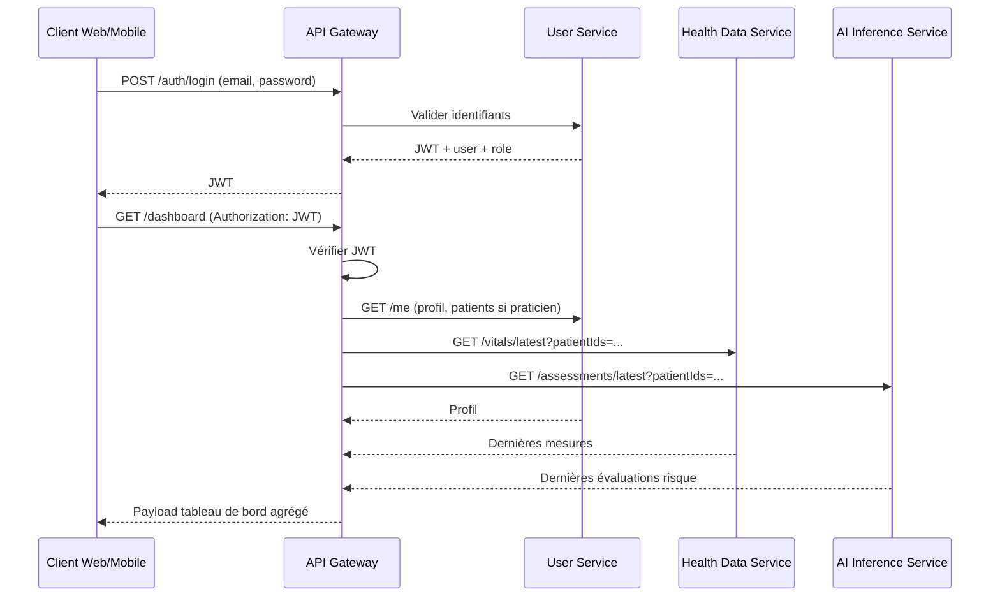

# Diagramme de séquence

## Séquence : Envoi d'une mesure vitale et réception d'une alerte

```mermaid
sequenceDiagram
    participant U as Utilisateur / Dispositif
    participant GW as API Gateway
    participant HDS as Health Data Service
    participant AI as AI Inference Service
    participant NS as Notification Service
    participant DB as MongoDB / PostgreSQL

    U->>GW: POST /vitals (heartRate, bp, spo2)
    GW->>GW: Auth JWT + RBAC
    GW->>HDS: Forward requête
    HDS->>HDS: Validation plages & qualité
    HDS->>DB: Persister VitalRecord
    HDS->>AI: Événement nouvelle donnée
    AI->>AI: Charger modèle, prédire risque
    AI->>DB: Persister RiskAssessment
    alt Risque élevé
        AI->>NS: Demande envoi alerte
        NS->>DB: Créer Alert
        NS->>U: Push / Email / SMS
    end
    HDS-->>GW: 201 Created
    GW-->>U: 201 + id enregistrement
```

## Séquence : Connexion et chargement du tableau de bord

```mermaid
sequenceDiagram
    participant C as Client Web/Mobile
    participant GW as API Gateway
    participant US as User Service
    participant HDS as Health Data Service
    participant AI as AI Inference Service

    C->>GW: POST /auth/login (email, password)
    GW->>US: Valider identifiants
    US-->>GW: JWT + user + role
    GW-->>C: JWT

    C->>GW: GET /dashboard (Authorization: JWT)
    GW->>GW: Vérifier JWT
    GW->>US: GET /me (profil, patients si praticien)
    GW->>HDS: GET /vitals/latest?patientIds=...
    GW->>AI: GET /assessments/latest?patientIds=...
    US-->>GW: Profil
    HDS-->>GW: Dernières mesures
    AI-->>GW: Dernières évaluations risque
    GW-->>C: Payload tableau de bord agrégé
```
