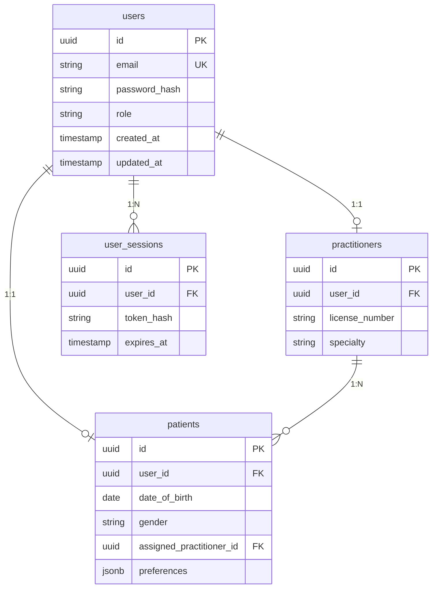

# Modélisation de la base de données – Diagramme ER

## PostgreSQL (données structurées – utilisateurs, métadonnées)

## MongoDB (données de santé – collections principales)

- **vital_records**  
  `{ patientId, type, value, unit, timestamp, source, deviceId?, qualityScore?, validated }`

- **risk_assessments**  
  `{ patientId, riskLevel, confidence, factors[], recommendations[], modelVersion, createdAt }`

- **alerts**  
  `{ patientId, type, severity, message, acknowledged, acknowledgedBy?, createdAt }`

- **audit_logs**  
  `{ userId, action, resource, resourceId, timestamp, ip?, metadata }`

## Schéma relationnel résumé (PostgreSQL)

| Table       | Clé primaire | Clés étrangères              |
|------------|---------------|------------------------------|
| users      | id            | -                            |
| patients   | id            | user_id → users, assigned_practitioner_id → practitioners |
| practitioners | id          | user_id → users              |
| user_sessions | id         | user_id → users              |

Les données temps réel (vitals, assessments, alerts) sont stockées dans MongoDB pour flexibilité et volume ; les relations avec les utilisateurs restent via `patientId` / `userId` cohérents avec PostgreSQL.
